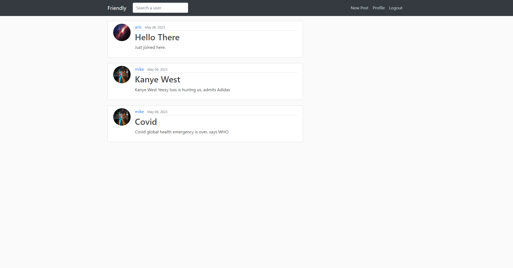
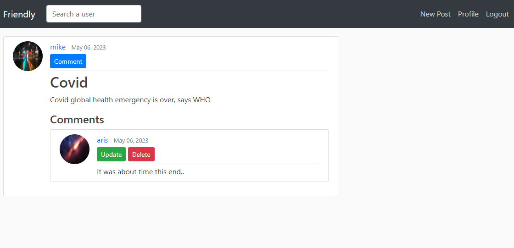
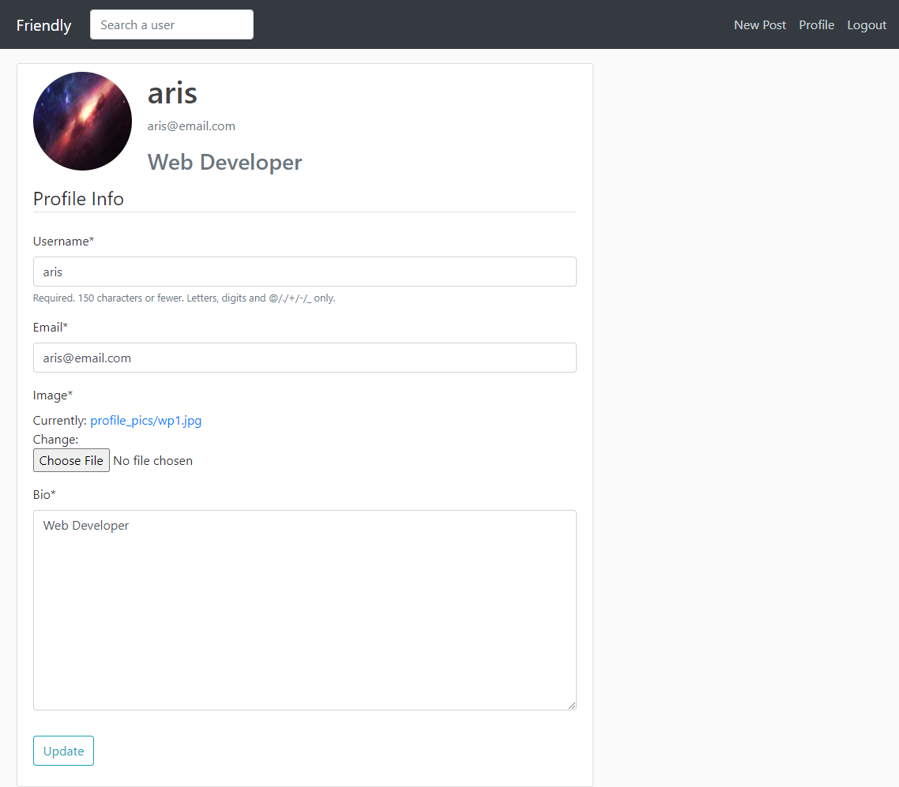

# Friendly

Web Application built with **Django**.

## Simple way to install using pipenv.

- `git clone https://github.com/arischaristes/Friendly.git`

- Make sure you are in the same directory as **requirements.txt**.

- `pipenv install ` (All requirements will be installed automatically.)

- `python manage.py makemigrations`

- `python manage.py migrate`

- `python manage.py runserver` (starts the local server)

If you want to create **admin** account:

- `python manage.py createsuperuser`

## Home Preview

## Post Preview

## Profile Preview

